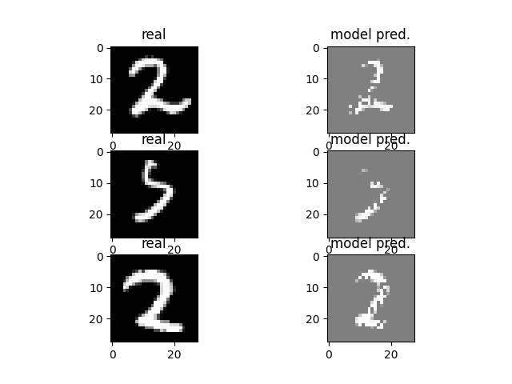
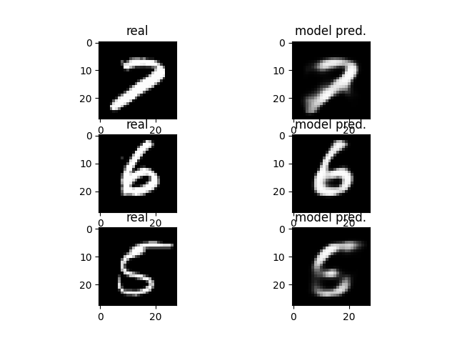
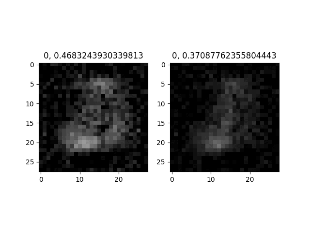
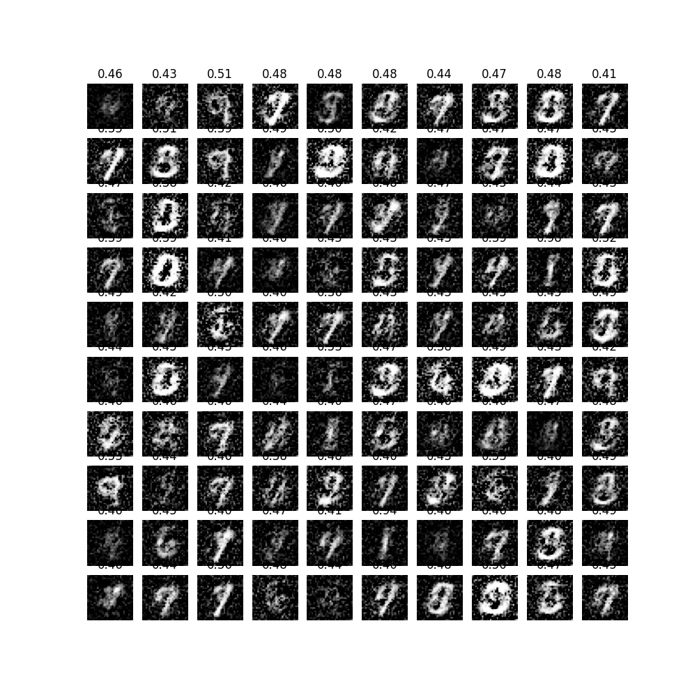

# GAN-indiv-study
It's a part of my indiv course about GAN 

## Auto Encoder

it's 60 epochs trained of 20 dimension latent space result.
- gray background
- it's like s&p noise

## Variational Auto Encoder

it's 60 epochs trained of 20 dimension latent space result.
- more realistice
- no s&p noise but blur instead
- better performance but smaller parameters

## Fully Connected Uncondition GAN

traing result from epoch = 0->99

from result image

1. mode collapsed
1. a lot of noise
## Resources
1. DCGANs -- [pdf here](https://arxiv.org/pdf/1511.06434.pdf)
1. WGANs -- [pdf here](https://arxiv.org/pdf/1701.07875.pdf)
1. Improved Training of Wasserstein GANs -- [pdf here](https://arxiv.org/pdf/1704.00028.pdf)
