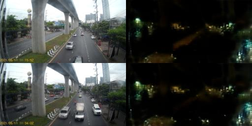

# GAN-indiv-study
It's a part of my indiv course about GAN 

# Table of Contents
- [Introduction](#introduction)
- [Dataset](#dataset)
    - [AJDATASET01](#ajdataset01)
    - [AJDATASET02](#ajdataset02)
    - [AJDATASET03M](#ajdataset03m)
- [Environment](#environment)
- [Experiment](#experiment)
- [Utilization in this repo](#utilization-in-this-repo)
    - [Image extraction from video](#image-extraction-from-video)
- [Resources](#resources)


# Introduction
This repo is used to record my indiv study about GAN.
The main goal is about **image transation** (from **day image** to **night image** and the other hand).
In this project, I use [**AU-GAN**](#resources) to be the main model.

# Dataset
## AJDATASET01
- Only from 1 video (**2021_0607_184742_013.MOV**) 
    - extract every 10 second.
- Total `264 images`
    - Train : `236 images`
        - Day : `67 images`
        - Night : `169 images`
    - Test : `28 images`
        - Day : `7 images`
        - Night : `21 images`

## AJDATASET02
- Original video
    1. `2021_0607_184742_013.MOV`
    1. `Top.MOV`
    - extract every 10 second
    > different location
- Total `390 images`
    - Train : `300 images`
        - Day : `150 images`
        - Night : `150 images`
    - Test : `90 images`
        - Day : `50 images`
        - Night : `40 images`

## AJDATASET03M
- Original video
    1. `2021_0610_194042_002.MOV` (Night video)
    1. `2021_0610_135731_008.MOV` (Day video)
    - extract every 2 second.
    > same location, different time
- Total `3,090 images` 
    - Train : `3700 images`
        - Day : `1853 images`
        - Night : `1847 images`
    - Test : `390 images`
        - Day : `190 images`
        - Night : `200 images`

# Environment
This repo use the same environment as [**GAN-study**](#resources) repo.

# Experiment

## pure_data_same_model_as_BDD
> Use the same model structure that used in BDD100k dataset to train `AJDATASET01`
### setting
```bash
python main.py --dataset_dir AJDATASET01 \  
                --phase train \
                --experiment_name pure_data_same_model_as_BDD \
                --batch_size 2  \
                --load_size 286 \
                --fine_size 128 \
                --epoch 30 \
                --use_uncertainty True
```
- Batch size : `2`
- Load size : `286`
- Fine size : `128`
- Epoch : `30`
- Use uncertainty : `True`
- Learning rate : `0.0002`
- Dataset : [`AJDATASET01`](#ajdataset01)
### Result
- example for *Night to Day*
    
- example for *Day to Night*
    
### Analysis
1. Night and Day image in dataset are too similar.
    - e.g. In the both day and night image, every car has the light on 
    - This make the translated image very similar to the original image.
1. The resolution of model is very low (256x128) so might not able to count the car.

## augmented_ajdataset
> Use `AJDATASET02` which create from 2 videos in different time and location to train.
### setting
```bash
python main.py --dataset_dir AJDATASET02 \
                --phase train \
                --experiment_name augmented_ajdataset \
                --batch_size 2  \
                --load_size 286 \
                --fine_size 128 \
                --epoch 30 \
                --use_uncertainty True \
```
- Batch size : `2`
- Load size : `286`
- Fine size : `128`
- Epoch : `30`
- Use uncertainty : `True`
- Learning rate : `0.0002`
- Dataset : [`AJDATASET02`](#ajdataset02)
### Result
- example for *Night to Day*
    
- example for *Day to Night*
    
### Analysis
1. Can't use translated image to do anything.
    - The previous infomation such as car, road, etc. are gone.
    - This may cause by **load size** and **fine size** are too different.
1. Maybe **learning rate** are not relate with **new batch-size**
    - According to [this paper](https://arxiv.org/abs/1404.5997), if we multiply the batch size by k, we multiply the learning rate by square root of k as well.

## same_load_and_fine_size_better_resol
> Try to create translation on (512x256) resolution image.
### setting
```bash
python main.py --dataset_dir AJDATASET01 \
                --phase train \
                --experiment_name same_load_and_fine_size_better_resol \
                --batch_size 1 \
                --load_size 286 \
                --fine_size 256 \
                --epoch 20 \
                --use_uncertainty True \
```
- Batch size : `1`
- Load size : `286`
- Fine size : `256`
- Epoch : `20`
- Use uncertainty : `True`
- Learning rate : `0.0002`
- Dataset : [`AJDATASET01`](#ajdataset01)
### Result
- example for *Night to Day*
    
- example for *Day to Night*
    
###
1. The resolution is better than before.
    - Compare to [pure_data_same_model_as_BDD](#pure_data_same_model_as_bdd) experiment.
1. With better resolution and the more close between **load size** and **fine size**.
    - The translation is better than before.


# Utilization in this repo
## Image extraction from video
This use to extract images from video and save it to the folder. 
It's able to extract infomation from image
1. If video's name is fit the `yyyy_mmdd_hhmmss_ffff` format, `info_dict` will save the time information of each image.
1. The image labels to **night** if the time is between 18:00 to 6:00, and **day** if the time is between 6:00 to 18:00. **except**
    - `Top.MOV` is **day** image


The code is in [Indiv_image](./Indiv_image/) which has 2 files.
1. [image_extractor.py](./Indiv_image/image_extractor.py) is used to extract 
images from video. as python script

    Usage 
    ```bash 
    python ./indiv_image/image_extractor.py --clip_path <path to video> \    
                                            --image_path <path to save image> \
                                            --info_path <path to save info>
    ```
<!-- 
python image_extractor.py --clip_path E:/indiv_vdo/2021_0610_194042_002.MOV --image_path E:/indiv_vdo/extracted/image_pool --info_path E:/indiv_vdo/extracted/info_pool
 -->

1. [image_extractor.ipynb](./Indiv_image/image_extractor.ipynb) is used to extract images from video. as jupyter notebook


## Resources

1. AU-GAN
    - Official implementation : [Github](https://github.com/jgkwak95/AU-GAN)
    - Paper : [pdf here](https://www.bmvc2021-virtualconference.com/assets/papers/1443.pdf)
1. DCGANs -- [pdf here](https://arxiv.org/pdf/1511.06434.pdf)
1. WGANs -- [pdf here](https://arxiv.org/pdf/1701.07875.pdf)
1. Improved Training of Wasserstein GANs -- [pdf here](https://arxiv.org/pdf/1704.00028.pdf)
